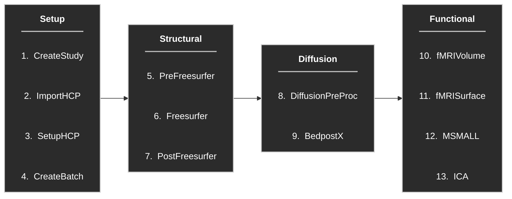

# QuNex HCP-Style Processing Pipeline

Document outlining the main steps for processing HCP-style data using the **QuNex/HCP pipeline** *without* a recipe.

**Authors:** Stephania Assimopoulos, Daniel Halls  
**Example dataset:** HCP Development (to demonstrate path set-up)

---

## Overview

This repository contains shell scripts implementing a step-by-step QuNex processing workflow for HCP-style datasets. Each processing stage is executed independently once previous steps have completed successfully.

All scripts share a common configuration file (`Preamble.sh`) that defines environment modules and dataset-specific paths.

---

## Important Notes

1. Each script sources a `Preamble.sh` file located in the same directory as the scripts.  
   Edit this file to match dataset paths and required modules.

2. Raw data must exist in the data directory specified in `Preamble.sh`.  
   The directory structure is tied to the expected QuNex output setup. See example `Preamble.sh`.

3. Setup scripts are run interactively in the terminal, while processing steps can be submitted to the compute queue.

4. **Each setup step should be executed independently**, only after all previous steps have completed successfully.

5. The **Structural** processing is required for all subsequent steps.

6. Each script includes a `--bind` flag allowing use of symlinks by attaching original data paths inside the container environment.

---

## Pipeline Overview


---

## Pipeline Steps

### 1. Setup

Initial study creation and preparation.

```bash
sh ${script_repo}/CreatStudy.sh ${subject_id}
sh ${script_repo}/ImportHCP.sh ${subject_id}
sh ${script_repo}/SetupHCP.sh ${subject_id}
sh ${script_repo}/CreateBatch.sh ${subject_id}
```

### 2. Structural

Structural MR processing.

```bash
sh ${script_repo}/PreFreesurfer.sh ${subject_id} ${queue_name}
sh ${script_repo}/Freesurfer.sh ${subject_id} ${queue_name}
sh ${script_repo}/PostFreesurfer.sh ${subject_id} ${queue_name}
```

### 3. Diffusion

Diffusion processing + BedpostX

```bash
sh ${script_repo}/DiffusionPreProc.sh ${subject_id} ${queue_name}
sh ${script_repo}/BedpostX.sh ${subject_id} ${queue_name} ${model}
```

### 4. Functional

Functional preprocessing

```bash
sh ${script_repo}/fMRIVolume.sh ${subject_id} ${queue_name}
sh ${script_repo}/fMRISurface.sh ${subject_id} ${queue_name}
sh ${script_repo}/MSMALL.sh ${subject_id} ${queue_name}
sh ${script_repo}/ICA.sh ${subject_id} ${queue_name}
```

### BONUS: fMRI QC functions

${script_repo}/quality_control.py
